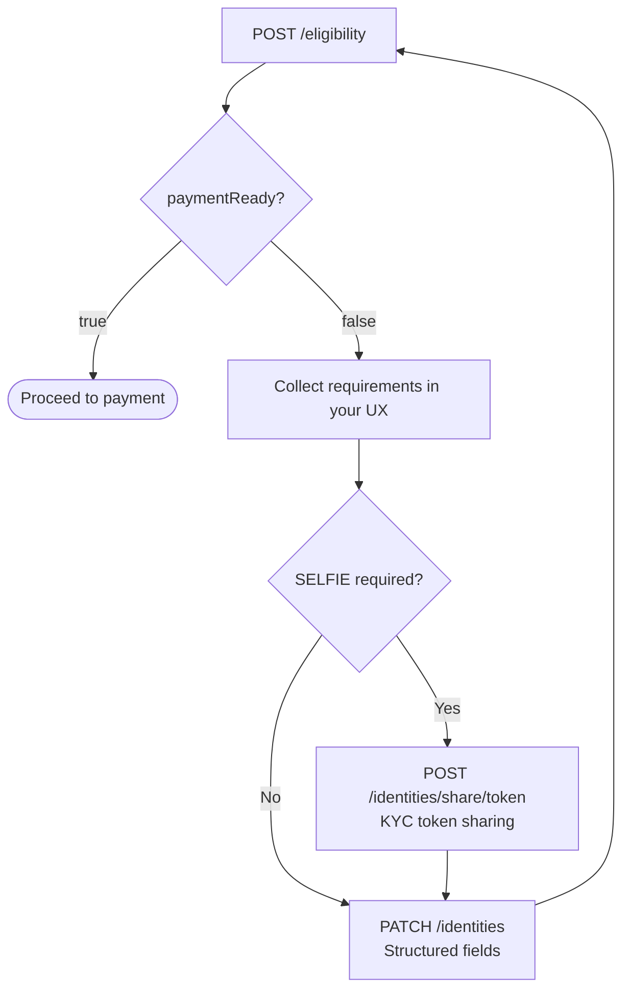

https://github.com/menghaobu7-png/meng-hao-bu-project# Rate Limits

> For the complete documentation index, see [llms.txt](https://docs.banxa.com/llms.txt). Append `.md` to any page URL for its markdown version.


Banxa applies API rate limits to ensure platform stability and fairness across all clients. Requests are continuously monitored, and excessive traffic will be throttled.

- **Production limit**: 500 requests per minute per IP address (applies across all endpoints).
- **Sandbox limit**: 120 requests per minute per merchant account (applies across all endpoints). Sandbox is a shared testing environment; the lower limit keeps it responsive for all merchants.
- **Error code**: If limits are exceeded, the API returns an HTTP `429 Too Many Requests` response.


If you consistently encounter rate limiting under normal test or production usage, contact your Customer Success Manager or Banxa Support.

## Best Practices

**Monitor for 429 errors**

- Occasional 429s are expected.
- If you see them repeatedly, review your architecture and API usage.


**Retry responsibly**

- Avoid blind retries.
- Use exponential backoff when retries are required.
- For periodic checks, let the next scheduled call handle it instead of retrying.


**Use webhooks wherever possible**

- Webhooks push updates to your system.
- This avoids unnecessary polling and reduces load on both Banxa and your infrastructure.


**Call endpoints only when needed**

- Example: Call `GET /price` only when a user is actively viewing a quote, rather than polling continuously.


**Batch operations**

- For reconciliation or reporting, use batch processes instead of sending many parallel calls.# Authentication

> For the complete documentation index, see [llms.txt](https://docs.banxa.com/llms.txt). Append `.md` to any page URL for its markdown version.


## Quick summary

- **Auth type:** HMAC-SHA256
- **Header:** `Authorization: Bearer API_KEY:SIGNATURE:NONCE`
- **Nonce:** Unix timestamp in microseconds (16 digits), unique per request
- **Signature:** Hex-encoded HMAC-SHA256 of a newline-separated canonical string


Important notice on Native API access
The Native API is not enabled by default and is not self-serve. Access is granted per account under a signed agreement with Banxa that covers headless integration.

Integrating the Native API without a signed agreement will lead to delays going live.

If you do not have Native API enabled in the Partner Dashboard, contact your Banxa Account Manager to enquire about our approval process.

## Base URL

| Environment | Base URL |
|  --- | --- |
| Sandbox | `https://api.banxa-sandbox.com/eapi/v0/` |
| Production | `https://api.banxa.com/eapi/v0/` |


## Authorization header

Every request must include:

```
Authorization: Bearer API_KEY:SIGNATURE:NONCE
```

| Component | Description |
|  --- | --- |
| `API_KEY` | Public API key provided during onboarding |
| `SIGNATURE` | Hex-encoded HMAC-SHA256 signature |
| `NONCE` | Unix timestamp in microseconds (16 digits) |


## Building the signature

Construct a newline-separated canonical string, then sign it with HMAC-SHA256 using your API secret.

**GET request:**

```
METHOD\nPATH_WITH_QUERY_STRING\nNONCE
```

**POST request:**

```
METHOD\nPATH\nNONCE\nCOMPACT_JSON_BODY
```

Rules:

- Use the request **path only** — never the full URL with domain
- Include the query string in the path for GET requests
- JSON body must be compact — no whitespace between elements
- Generate a new nonce for every request


Nonce precision
Use **microseconds (16 digits)**. Seconds (10 digits) and milliseconds (13 digits) are also accepted, but millisecond precision causes nonce collisions under concurrent load: two requests generated in the same millisecond produce the same nonce, and the second is rejected as reused (`40003`).

Generate the nonce from a clock with genuine sub-millisecond resolution. Multiplying a millisecond timestamp by 1000 pads it to 16 digits without adding precision and does **not** prevent collisions.

Examples:

```
GET\n/eapi/v0/price\n1785804345837761

POST\n/eapi/v0/ramps\n1785804345837761\n{"identityReference":"example_01"}
```

## Code examples

```python Python
import hmac
import time

key = '[YOUR_API_KEY]'
secret = '[YOUR_API_SECRET]'

def generate_hmac(method, path, payload=None):
    nonce = str(int(time.time() * 1_000_000))
    parts = [method, path, nonce]
    if payload:
        parts.append(payload)
    data = '\n'.join(parts)
    signature = hmac.new(secret.encode('utf-8'), data.encode('utf-8'), 'sha256').hexdigest()
    return f'{key}:{signature}:{nonce}', nonce
```

```javascript Node.js
const crypto = require('crypto');

const key = '[YOUR_API_KEY]';
const secret = '[YOUR_API_SECRET]';

function generateHmac(method, path, payload = null) {
    const nonce = Math.round((performance.timeOrigin + performance.now()) * 1000).toString();
    const parts = [method, path, nonce];
    if (payload) parts.push(payload);
    const data = parts.join('\n');
    const signature = crypto.createHmac('sha256', secret).update(data).digest('hex');
    return `${key}:${signature}:${nonce}`;
}
```

```typescript TypeScript
import { createHmac } from 'node:crypto';

const key = '[YOUR_API_KEY]';
const secret = '[YOUR_API_SECRET]';

export function generateHmac(method: string, path: string, payload: string | null = null): string {
    const nonce = Math.round((performance.timeOrigin + performance.now()) * 1000).toString();
    const parts = [method, path, nonce];
    if (payload) parts.push(payload);
    const data = parts.join('\n');
    const signature = createHmac('sha256', secret).update(data).digest('hex');
    return `${key}:${signature}:${nonce}`;
}
```

```php PHP
<?php
$key = '[YOUR_API_KEY]';
$secret = '[YOUR_API_SECRET]';

function generateHmac($method, $path, $payload, $key, $secret) {
    $nonce = (string)(int)(microtime(true) * 1000000);
    $parts = [$method, $path, $nonce];
    if ($payload) $parts[] = $payload;
    $data = implode("\n", $parts);
    $signature = hash_hmac('sha256', $data, $secret);
    return "{$key}:{$signature}:{$nonce}";
}
```

```java Java
import javax.crypto.Mac;
import javax.crypto.spec.SecretKeySpec;
import java.time.Instant;
import java.util.Formatter;

public class BanxaAuth {
    private static final String KEY = "[YOUR_API_KEY]";
    private static final String SECRET = "[YOUR_API_SECRET]";

    public String generateHmac(String method, String path, String payload) throws Exception {
        Instant now = Instant.now();
        String nonce = String.valueOf(now.getEpochSecond() * 1_000_000L + now.getNano() / 1_000L);
        String data = method + "\n" + path + "\n" + nonce;
        if (payload != null) data += "\n" + payload;

        SecretKeySpec signingKey = new SecretKeySpec(SECRET.getBytes(), "HmacSHA256");
        Mac mac = Mac.getInstance("HmacSHA256");
        mac.init(signingKey);
        Formatter formatter = new Formatter();
        for (byte b : mac.doFinal(data.getBytes())) {
            formatter.format("%02x", b);
        }
        return KEY + ":" + formatter.toString() + ":" + nonce;
    }
}
```

```csharp .NET
using System;
using System.Diagnostics;
using System.Security.Cryptography;
using System.Text;

public static class BanxaAuth
{
    private const string Key = "[YOUR_API_KEY]";
    private const string Secret = "[YOUR_API_SECRET]";

    // DateTime.UtcNow advances in ~15 ms steps on Windows. Anchor once, then
    // advance with the high-resolution timer for genuine microsecond precision.
    private static readonly long AnchorMicros =
        DateTimeOffset.UtcNow.ToUnixTimeMilliseconds() * 1_000L;
    private static readonly Stopwatch Clock = Stopwatch.StartNew();

    public static string GenerateHmac(string method, string path, string? payload = null)
    {
        // Elapsed.Ticks is always 100 ns units, so /10 is microseconds on every platform.
        var nonce = (AnchorMicros + Clock.Elapsed.Ticks / 10L).ToString();
        var parts = payload is null
            ? new[] { method, path, nonce }
            : new[] { method, path, nonce, payload };
        var data = string.Join("\n", parts);

        using var hmac = new HMACSHA256(Encoding.UTF8.GetBytes(Secret));
        var signature = Convert.ToHexString(hmac.ComputeHash(Encoding.UTF8.GetBytes(data)))
                               .ToLowerInvariant();

        return $"{Key}:{signature}:{nonce}";
    }
}
```

```swift Swift
import CryptoKit

let key = "[YOUR_API_KEY]"
let secret = "[YOUR_API_SECRET]"

func generateHmac(method: String, path: String, payload: String? = nil) -> String {
    let nonce = String(Int(Date().timeIntervalSince1970 * 1_000_000))
    var parts = [method, path, nonce]
    if let payload = payload { parts.append(payload) }
    let data = parts.joined(separator: "\n")
    let secretKey = SymmetricKey(data: secret.data(using: .utf8)!)
    let signature = HMAC<SHA256>.authenticationCode(for: data.data(using: .utf8)!, using: secretKey)
        .map { String(format: "%02hhx", $0) }.joined()
    return "\(key):\(signature):\(nonce)"
}
```

```ruby Ruby
require 'openssl'

KEY = '[YOUR_API_KEY]'
SECRET = '[YOUR_API_SECRET]'

def generate_hmac(method, path, payload = nil)
    now = Time.now
    nonce = (now.to_i * 1_000_000 + now.usec).to_s
    parts = [method, path, nonce]
    parts << payload if payload
    data = parts.join("\n")
    signature = OpenSSL::HMAC.hexdigest('sha256', SECRET, data)
    "#{KEY}:#{signature}:#{nonce}"
end
```

## Authentication errors

| Code | Cause |
|  --- | --- |
| `40001` | Nonce is not a valid Unix timestamp — must be 10, 13, or 16 digits (seconds, milliseconds, or microseconds) |
| `40002` | Nonce is too old — check your system clock is in sync |
| `40003` | Nonce already used — generate a new nonce per request |
| `40100` | API key not recognised — check you are using the correct environment key |
| `40101` | Authorization header is malformed — format must be `Bearer API_KEY:SIGNATURE:NONCE` |
| `40102` | Authorization header is missing |
| `40103` | Signature mismatch — check path, newline separators, compact JSON, and correct secret |


## Best practices

- Generate a **new nonce for every request**
- Use **microsecond precision** for the nonce — millisecond timestamps collide under concurrent load
- Keep your system clock in sync (NTP)
- Always serialize JSON with **no whitespace** before signing
- Use the **request path only** — never the full URL with domain
- Log the `request_id` from error responses for debugging


If issues persist, contact your Banxa Account Manager.# Banxa Native API

> For the complete documentation index, see [llms.txt](https://docs.banxa.com/llms.txt). Append `.md` to any page URL for its markdown version.


Fully headless ramp infrastructure for platforms that manage their own user verification (KYC) and want full control over the transaction experience. No Banxa screens, no redirects — your platform owns the UX and the identity flow. Banxa provides the regulated payment rails, compliance validation, and settlement.

If you want Banxa to handle KYC and checkout instead, see [Banxa Hosted Checkout](/products/hosted-checkout).

**Best for:** Exchanges, custodial wallets, and fintech apps with user accounts, KYC infrastructure, and a backend.

Important notice on Native API access
The Native API is not enabled by default and is not self-serve. Access is granted per account under a signed agreement with Banxa that covers headless integration.

Integrating the Native API without a signed agreement will lead to delays going live.

If you do not have Native API enabled in the Partner Dashboard, contact your Banxa Account Manager to enquire about our approval process.

## Why Native?

Full UX ownership
No Banxa-branded screens anywhere in the flow. Your users never leave your product — pricing, KYC, and payment all happen natively.

Partner-managed KYC
You run KYC — via Sumsub token sharing, identity reliance, or document submission. Banxa validates compliance through the eligibility API. Users are never sent to a Banxa verification screen.

Bank transfers are fully API-driven
Bank payment rails run entirely through the Native API. No SDK or webview required for bank transfer flows.

PCI handled by Banxa
Card, Apple Pay, and Google Pay are captured via a Banxa payment SDK using Primer. Your platform does not need PCI compliance certification.

## Core capabilities

Identities
Establish and manage customer identity. Set up via KYC token sharing (Sumsub), identity reliance, or document verification. Must be established before eligibility or payment can proceed.

Eligibility
Evaluate whether a transaction can proceed for a given identity, payment method, and fiat/crypto pair. Returns `paymentReady: true/false` plus any outstanding requirements.

Quotes & Pricing
Retrieve real-time pricing and fee breakdowns before creating a transaction. Used for displaying quotes and confirming transaction parameters.

Limits
Retrieve applicable transaction limits for a given identity and context. Reflects provider constraints, customer tier, and time-based windows.

Ramps
Create and manage on-ramp and off-ramp transactions. Bank transfers run fully through the API; card and wallet payments use a Banxa payment SDK.

Webhooks
Real-time notifications for ramp lifecycle events and KYC status changes. Banxa retries delivery on non-2xx responses.

## Before you start

What you need
HMAC API credentials from Banxa (API key + secret), a backend capable of server-to-server calls, a persistent unique identifier per user (`identityReference`), and a KYC provider or reliance arrangement. A Banxa payment SDK (React Native, iOS, Android, Flutter, or JS Native Payments for web) is required for card, Apple Pay, and Google Pay — not needed for bank transfer-only integrations.

| Environment | Base URL |
|  --- | --- |
| Sandbox | `https://api.banxa-sandbox.com` |
| Production | `https://api.banxa.com` |


Not sure if Native is the right fit? The [Integration Overview](/products/native-api/docs/how-it-works/integration-overview) covers requirements and where Native is and isn't the right choice. Ready to build? Go straight to the [Integration Guide](/products/native-api/docs/guides/foundations).

## Quick start

All Native API requests use HMAC-SHA256 authentication. See [Authentication](/products/native-api/docs/getting-started/authentication) for how to generate the signature.

```bash Get a price quote
GET https://api.banxa.com/eapi/v0/price \
  ?identityReference=user-abc123 \
  &fiat=USD \
  &crypto=ETH \
  &blockchain=ETHEREUM \
  &method=credit-debit-card \
  &transactionType=ONRAMP \
  &fiatAmount=100
Authorization: Bearer {apiKey}:{hmacSignature}:{nonce}
```

```json
{
  "identityReference": "user-abc123",
  "source": {
    "fiat": { "id": "USD", "method": "credit-debit-card" },
    "amount": "100.00"
  },
  "target": {
    "crypto": { "id": "ETH", "blockchain": "ETHEREUM" },
    "amount": "0.03421"
  },
  "processingFee": "3.99",
  "networkFee": "0.50",
  "marketRate": {
    "crypto": { "USD": "2922.50" },
    "forex": { "reference": "USD" }
  }
}
```

The `identityReference` is your stable per-user identifier — the same value is used across identity, eligibility, and ramp creation. → [Full Integration Guide](/products/native-api/docs/guides/foundations)# Integration Guide

> For the complete documentation index, see [llms.txt](https://docs.banxa.com/llms.txt). Append `.md` to any page URL for its markdown version.


Every Banxa Native integration shares the same core steps: establish an identity, get a price, check eligibility, then execute payment. The payment method guides — bank transfer, Apple Pay, Google Pay, cards — each pick up from where this page leaves off.

Read this page once. Then follow the guide for your payment method.

## Prerequisites

Before you begin:

- **HMAC API credentials** — API key and secret from the Merchant Dashboard. Required for all server-to-server calls.
- **A backend** — all Native API calls use server-to-server HMAC authentication. Client-side API calls are not supported.
- **An `identityReference` strategy** — a stable per-user identifier that you own. See [Choosing an identityReference](/products/native-api/docs/how-it-works/identity-reference) before proceeding.
- **A Banxa payment SDK** — required for card, Apple Pay, and Google Pay. Pick the SDK that matches your app: [React Native](/products/native-api/docs/sdk/sdk-reference), [iOS](/products/native-api/docs/sdk/ios-sdk-reference), [Android](/products/native-api/docs/sdk/android-sdk-reference), [Flutter](/products/native-api/docs/sdk/flutter-sdk-reference), or [JS Native Payments](/products/native-api/docs/sdk/javascript-native-payments-sdk-reference) for web. Not required for bank transfers or the Embedded Payment Button.


The examples on this page use the React Native SDK. The iOS and Android SDKs follow the same sequence with platform-specific method names.

Install the React Native SDK and its peer dependencies:

```bash
npm install @banxa-official/react-native-sdk @primer-io/react-native react-native-webview
cd ios && pod install
```

Initialise the SDK once at app startup:

```typescript
import { Banxa } from '@banxa-official/react-native-sdk';

const banxa = new Banxa({
  apiKey: 'YOUR_API_KEY',
  partner: 'your-partner-id',
  environment: 'sandbox', // or 'production'
});
```

For full SDK configuration options, see the [React Native SDK Reference](/products/native-api/docs/sdk/sdk-reference), the [iOS SDK Reference](/products/native-api/docs/sdk/ios-sdk-reference), or the [Android SDK Reference](/products/native-api/docs/sdk/android-sdk-reference).

## Two integration approaches

Before diving into the steps below, decide how much of the flow you want to own. This guide documents the full control approach — steps 1–4 below apply to that path.

### Full control

Your backend handles identity, pricing, and eligibility before payment is invoked. You call the SDK only at the payment step. Any screens for collecting KYC requirements are yours — your design, your brand, your UX.

This is the recommended approach for most Banxa Native integrations.

### Quick start

Call `createOrderAndShowPrimerCheckout` without running eligibility first. The SDK creates the order and Banxa routes the user automatically: verified users go directly to the native payment sheet; users who need KYC are routed to a Banxa-hosted WebView where Banxa handles verification.

```typescript
const result = await banxa.buy.createOrderAndShowPrimerCheckout(orderRequest, {
  paymentMethod: 'applePay', // 'card' | 'applePay' | 'googlePay'
  callbacks: {
    onCheckoutComplete: () => { /* payment succeeded */ },
    onError: (error) => { /* payment failed or unavailable */ },
    onDismiss: () => { /* user dismissed */ },
  },
});

if (isPrimerCheckoutWebViewResult(result)) {
  // Banxa routed to hosted WebView (KYC required or payment method unavailable natively)
  // render <CheckoutWebView {...result.webViewProps} />
}
```

The trade-off: Banxa runs eligibility internally and you don't see the result. If the user needs KYC, it happens in Banxa's WebView — outside your product.

Use quick start when you want the simplest possible path to a working integration — for example, during early development — or when you're explicitly comfortable with Banxa handling KYC for users who need it. The iOS and Android SDKs behave the same way: `startPayment` and `StartPayment` run eligibility internally and fall back to Banxa-hosted verification, without exposing the result to your app. If you choose this path, skip steps 3 and 4 below.

## Step 1 — Establish an identityReference

Create an identity record for the user before checking eligibility. The minimum required field is `identityReference` — include any personal details you already have, as they reduce the likelihood of requirements being returned at eligibility.

```http
POST /eapi/v0/identities/basic
Content-Type: application/json

{
  "identityReference": "partner-abc123",
  "email": "user@example.com",
  "dateOfBirth": "1990-01-15"
}
```

For returning users, reuse the existing `identityReference`. If you don't have it stored, see [Choosing an identityReference](/products/native-api/docs/how-it-works/identity-reference) for retrieval options and all new-user flow variants.

Never recreate an identity
If you attempt to create an identity for an email that already exists in Banxa, you will receive a `422` with code `81`: `"This identity exists for this reference or email address."` Do not retry the creation. Instead, retrieve the existing identity using `GET /eapi/v0/identities/{identityReference}?email=user@example.com` — Banxa returns the actual `identityReference` linked to that email, regardless of what value you supply in the path parameter.

If you verify users with Sumsub, share the verification token at this point. Token sharing satisfies `NAME`, `DOB`, `SELFIE`, and `DOCUMENT` requirements upfront so eligibility is more likely to return `paymentReady: true` on the first check. See [KYC Token Sharing](/products/native-api/docs/how-it-works/kyc-token-sharing).

## Step 2 — Get pricing

There are two pricing endpoints:

| Endpoint | Rate locked? | Expiry to manage? |
|  --- | --- | --- |
| `GET /eapi/v0/price` | No | No |
| `GET /eapi/v0/quote` | Yes — `quoteId` with 3-minute TTL | Yes |


This guide uses indicative pricing. It can be called at any point in the flow and has no expiry to handle. The trade-off is that the rate is not locked — if you display a price and then create the ramp without refreshing, the rate may have moved and the user receives a different amount than shown. Refresh the price close to ramp creation to minimise the gap.

The locked quote (`GET /eapi/v0/quote`) eliminates this risk but is only supported for bank transfer ramp creation — no payment SDK and no Embedded Payment Button accepts a `quoteId`.

```http
GET /eapi/v0/price?fiat=AUD&crypto=USDT&blockchain=TRON&method=payid-bank-transfer&transactionType=ONRAMP&fiatAmount=500
```

Pass `fiatAmount` or `cryptoAmount` — not both. If you're building a bank transfer integration and want to lock the rate shown on the confirmation screen, see [Pricing & Quote ID](/products/native-api/docs/how-it-works/quotes-and-pricing).

## Step 3 — Check eligibility

Before every transaction, confirm the user is cleared to proceed. Eligibility evaluates the user's identity state against the transaction context — amount, payment method, and jurisdiction.

```http
POST /eapi/v0/identities/transactions/eligibility
Content-Type: application/json

{
  "identityReference": "partner-abc123",
  "method": "payid-bank-transfer",
  "transactionType": "ONRAMP",
  "fiat": "AUD",
  "crypto": "USDT",
  "blockchain": "TRON",
  "fiatAmount": "500"
}
```

**Response: cleared to proceed**

```json
{
  "paymentReady": true,
  "kycRequirements": []
}
```

**Response: additional information required**

```json
{
  "paymentReady": false,
  "kycRequirements": ["OCCUPATION", "SOURCE_FUNDS"]
}
```

Do not create a ramp or invoke the SDK when `paymentReady` is `false`. See [Interpreting Eligibility](/products/native-api/docs/how-it-works/interpreting-eligibility) for the full requirements dictionary.

## Step 4 — Handle requirements (if any)

When eligibility returns requirements, collect the missing information in your UX and submit it before re-checking.

For structured fields (`NAME`, `DOB`, `ADDRESS`, `OCCUPATION`, `SOURCE_FUNDS`, `PURPOSE_OF_TX`, `TIN`, `DOCUMENT`, `POA`):

```http
PATCH /eapi/v0/identities
Content-Type: application/json

{
  "identityReference": "partner-abc123",
  "email": "user@example.com",
  "occupationIndustry": "Consulting, IT, or business services",
  "occupation": "IT developer",
  "sourceOfFunds": "Salary"
}
```

`email` is required on every PATCH request. Partial updates are supported — include only the fields you're updating.

For `SELFIE` — complete KYC provider token sharing first. Token sharing may satisfy multiple requirements in a single call. Then submit any remaining structured fields via PATCH. See [KYC Token Sharing](/products/native-api/docs/how-it-works/kyc-token-sharing).

After submitting, re-run eligibility. Repeat until `paymentReady: true`.



## Step 5 — Execute payment

Once `paymentReady: true` is confirmed, proceed to your payment method guide for the execution step:

Bank Transfer
Fully API-driven. No SDK required. Banxa returns funding instructions for the user to complete the transfer.

Apple Pay
Native payment sheet via the React Native, iOS, or Android SDK, or Embedded Payment Button for web apps. Requires platform setup.

Google Pay
Native payment sheet via the React Native or Android SDK, or Embedded Payment Button for web apps. Requires app-level approval for the SDK path.

Cards
Card input drawer via the React Native, iOS, or Android SDK. Requires 3DS SDK setup.

## Tracking transaction status

Transactions are asynchronous. Configure a webhook endpoint to receive status updates:

```json
{
  "order_id": "b7f1ffbb2f1bd7a5e2ba152b4049d234",
  "status": "COMPLETED",
  "status_date": "2026-04-17 03:45:00",
  "external_reason": "...",
  "fiat_currency": "AUD",
  "fiat_amount": "500.00",
  "crypto_coin": "USDT",
  "crypto_amount": "324.51",
  "transaction_hash": "0x..."
}
```

Acknowledge every webhook with a `200` response immediately, then process asynchronously. You can also poll directly using `GET /eapi/v0/ramps/{id}`. See [Webhooks](/products/native-api/docs/transaction-lifecycle/webhooks) for the full payload schema and status values.# Banxa Hosted Checkout

> For the complete documentation index, see [llms.txt](https://docs.banxa.com/llms.txt). Append `.md` to any page URL for its markdown version.


Banxa-managed checkout: Banxa handles KYC, payments, and regulatory compliance in full. Redirect users or embed the checkout in your app — three integration paths, from a simple URL redirect to a full mobile SDK.

**Best for:** Wallets, dApps, gaming platforms, and any team where time-to-market is the priority.

If you already run your own KYC and want to embed payments natively without any Banxa screens, see [Banxa Native API](/products/native-api).

## Integration paths

Three ways to integrate. Choose based on your platform and how much backend work you want to do.

Referral
Construct a Banxa URL with your parameters and redirect the customer — or embed as an iFrame. No backend required. Pre-fills crypto, fiat, amount, and wallet address.

Best for simple integrations, browser extensions, or any scenario without a backend.

API
Create orders server-side. Fetch live quotes in your own UI, create buy or sell orders, and redirect the customer to the returned `checkoutUrl`. Receive order updates via webhooks.

Best for integrations that need quote visibility, webhook-driven tracking, or KYC sharing.

Mobile SDKs
React Native, iOS, and Android SDKs wrapping Banxa Hosted Checkout. They handle checkout presentation, return URL detection, and error handling. No backend required for core flows.

Best for mobile apps that want Banxa checkout embedded in-app.

## What Banxa handles

KYC & Identity
Document verification, liveness checks, and returning customer recognition — handled inside the checkout flow.

Payments
Card, bank transfer, Apple Pay, Google Pay, and local payment methods across global markets.

Compliance & AML
Sanctions screening, transaction monitoring, and ongoing compliance — Banxa's obligation, not yours.

Settlement
Fiat purchase and crypto delivery managed by Banxa. Your platform receives the confirmed transaction result.

## Before you start

What you need from Banxa
A partner ID (`partnerRef`) used in all API endpoint paths, an API key for `x-api-key` authentication, and a separate set of sandbox credentials. → [Access & Setup](/products/hosted-checkout/docs/getting-started/access-and-setup)

| Environment | Base URL |
|  --- | --- |
| Sandbox | `https://api.banxa-sandbox.com/{partnerRef}/v2/` |
| Production | `https://api.banxa.com/{partnerRef}/v2/` |


Always build and test against sandbox before going live. → [Authentication & Environments](/products/hosted-checkout/docs/getting-started/authentication-and-environments)

## Reference

API Reference
Full endpoint reference — request schemas, response shapes, error codes.

Supported Payment Methods
All supported payment methods by country and transaction type.

Supported Crypto & Blockchains
All supported cryptocurrencies and blockchain networks.

Integration Best Practices
Error handling, idempotency, webhook validation, and production checklist.

## Quick start

Create a buy order and redirect the customer to the returned `checkoutUrl`. Include `externalCustomerId` to enable returning customer recognition.

```bash Create a buy order
curl -X POST "https://api.banxa.com/{partnerRef}/v2/buy" \
  -H "x-api-key: YOUR_API_KEY" \
  -H "Content-Type: application/json" \
  -d '{
    "crypto": "ETH",
    "fiat": "USD",
    "fiatAmount": "100",
    "walletAddress": "0xe3BDEFdAeFF070925eB7FfC49F9B30c647Cb751e",
    "redirectUrl": "https://yourapp.com/success",
    "externalCustomerId": "user-abc123"
  }'
```

Redirect the customer to the `checkoutUrl` in the response:

```json
{
  "id": "3b7f1c9d2b4a8e6f5d0c7a2b3f9e1d4c",
  "checkoutUrl": "https://pay.banxa.com/checkout/3b7f1c9d...",
  "externalCustomerId": "user-abc123",
  "fiat": "USD",
  "fiatAmount": "100.00",
  "crypto": "ETH",
  "blockchain": "ETHEREUM"
}
```

→ [Full API Integration guide](/products/hosted-checkout/docs/api-integration/api-integration-overview)# Android SDK Integration Guide

> For the complete documentation index, see [llms.txt](https://docs.banxa.com/llms.txt). Append `.md` to any page URL for its markdown version.


This guide walks through a complete Banxa Hosted Checkout integration in a native Android app using the Banxa Android SDK. By the end you will have a working buy flow: initialise the SDK once, render the `StartPayment` composable when the customer confirms, and confirm the final order status from your backend.

The Android SDK is headless and Compose-first. There is no Banxa Activity to launch and no WebView for you to manage. You supply an order request and callback lambdas, and the SDK presents checkout and reports the outcome.

For the full API surface, see the [Android SDK Reference](/products/hosted-checkout/docs/sdk-integration/android-sdk-reference).

## Before you start

### Prerequisites

- A native Android app on API level 24 or above, using Kotlin 2.0 or above with the Compose Compiler Gradle plugin.
- Jetpack Compose enabled in your project. The SDK's payment entry point is a composable.
- Your Banxa partner reference and API key. Use sandbox for development, production after approval.
- A configured webhook endpoint. Optional but recommended for order status tracking.


### Install the SDK

The Android SDK is published to Maven Central. Add the dependency to your module's Gradle build file.

```kotlin
dependencies {
    implementation("com.banxa.nativepaymentssdk:android-payments-sdk:1.0.0")
}
```

Maven Central
The SDK is published to Maven Central as [`com.banxa.nativepaymentssdk:android-payments-sdk`](https://central.sonatype.com/artifact/com.banxa.nativepaymentssdk/android-payments-sdk). Make sure `mavenCentral()` is listed in your repositories block. Check the Maven Central listing for the current version before pinning.

## Step 1: Initialise the SDK

Build a `BanxaConfig` and initialise once at app launch.

```kotlin
val config = BanxaConfig.Builder()
    .apiKey("YOUR_API_KEY")
    .partnerID("your-partner-id")
    .environment(Environment.SANDBOX)
    .build()

Banxa.initialize(config)
```

| Field | Description |
|  --- | --- |
| `apiKey` | Your v2 API key from the merchant dashboard. |
| `partnerID` | Your partner identifier. |
| `environment` | `Environment.SANDBOX` or `Environment.PRODUCTION`. Credentials are not interchangeable. |


## Step 2: Get a quote

Fetch live pricing before you show an amount to the customer. Call this close to when the price is displayed, because crypto rates move quickly and quotes are indicative.

```kotlin
val repository = BanxaRepository(
    RetrofitClient.getApi(config.baseUrl, config.environment)
)

val result = repository.getQuote(
    partner = config.partner,
    apiKey = config.apiKey,
    orderType = "buy",
    request = QuoteRequest(
        fiat = "AUD",
        crypto = "ETH",
        blockchain = "ETH",
        paymentMethodId = "debit-credit-card",
        fiatAmount = "200"
    )
)

result.onSuccess { quote ->
    println("Pay ${quote.fiatAmount}, receive ${quote.cryptoAmount}")
    println("Fees: processing=${quote.processingFee}, network=${quote.networkFee}")
}
```

Provide either `fiatAmount` or `cryptoAmount`. Quotes carry no quote id, so there is nothing to pass into the payment call.

Use the same repository to populate your currency and payment method selectors at runtime rather than hardcoding values. See the [Android SDK Reference](/products/hosted-checkout/docs/sdk-integration/android-sdk-reference).

## Step 3: Start the payment

Render the `StartPayment` composable when the customer confirms.

```kotlin
StartPayment(
    createOrderRequest = CreateOrderRequest(
        fiat = "EUR",
        crypto = "ETH",
        fiatAmount = "40",
        cryptoAmount = null,
        walletAddress = "0x0000000000000000000000000000000000000000",
        redirectUrl = "your-app-scheme://banxa-return",
        paymentMethodId = "debit-credit-card",
        email = "user@example.com"
    ),
    banxaDidReceiveCheckout = { result ->
        // Payment succeeded. Confirm the authoritative state from your backend.
    },
    banxaDidFail = { error ->
        // API, validation, network, decoding, or checkout failure.
    },
    banxaDidDismiss = {
        // The customer closed checkout without completing.
    }
)
```

### Required fields

| Field | Notes |
|  --- | --- |
| `fiat`, `crypto`, `fiatAmount` | The order amounts and assets. |
| `paymentMethodId` | The payment method to use. |
| `walletAddress` | The customer's receiving wallet address. |
| `email` | The customer's email address. |
| `redirectUrl` | Where the customer returns after checkout. |


Pass `externalCustomerId` as well. It is your stable per-customer identifier, and Banxa uses it to recognise returning customers so they do not repeat KYC.

Do not create orders in advance
`StartPayment` creates the order and presents checkout together, which keeps the order inside the one-minute window in which Banxa checkout must be loaded. Render it at the moment the customer confirms. There is no supported pattern for creating an order early and presenting it later.

A missing memo can permanently lose funds
XRP, XLM, EOS, and ATOM require a memo or tag. Pass it as `walletAddressTag` on `CreateOrderRequest`.

## Step 4: Handle the outcome

All three callbacks have a default no-op implementation, so supply only what you need.

| Callback | Fires when |
|  --- | --- |
| `banxaDidReceiveCheckout` | The customer completed payment. |
| `banxaDidFail` | Any Banxa, network, validation, or checkout failure. |
| `banxaDidDismiss` | The customer closed checkout without completing. |


`banxaDidReceiveCheckout` is a UI signal, not the authoritative order state. Do not credit the customer on it.

## Step 5: Confirm order status

The SDK does not expose order lookup. Confirm the final state from your backend using the Banxa API.

Only terminal statuses are final. Do not credit the customer until the order reaches `complete`. For the full list, see [Order Statuses](/products/hosted-checkout/docs/transaction-lifecycle/order-statuses), and for lookup see [Order Lookup](/products/hosted-checkout/docs/transaction-lifecycle/order-lookup).

## Step 6: Handle webhooks

Webhooks fire on every order status change and are the reliable mechanism for order tracking. Configure your webhook URL in the merchant dashboard.

The typical pattern:

- Success callback: optimistic UI update, "your order is processing".
- Webhook to your backend: authoritative order state.
- Backend pushes the update to the app, or the app re-fetches on resume.


See [Webhooks](/products/hosted-checkout/docs/transaction-lifecycle/webhooks) for payload structure and signature verification. Webhook signatures are verified with your HMAC secret, not the v2 `x-api-key`.

## Google Pay approval

When your Android app presents Google Pay, Google requires app-level approval before you can process live payments. Banxa holds Google Pay approval for its own website, and that approval applies only when the customer is redirected to an external browser or a Custom Chrome Tab, not when Google Pay is presented inside your app.

Start the approval process early. It is the most common cause of a delayed Android launch.

## KYC camera access

Banxa runs KYC inside the checkout the SDK presents. Declare `android.permission.CAMERA` in your manifest and request it at runtime before the customer reaches verification. Without it, document capture fails and the customer cannot complete KYC.

## Testing

Use sandbox for all development:

```kotlin
val config = BanxaConfig.Builder()
    .apiKey("YOUR_SANDBOX_API_KEY")
    .partnerID("your-partner-id")
    .environment(Environment.SANDBOX)
    .build()

Banxa.initialize(config)
```

Google Pay can be tested on a physical Android device or on an emulator with Google Play Services installed.

For test credentials, see [Sandbox Test Data](/products/hosted-checkout/docs/testing/sandbox-test-data).

## Native payment sheet

The SDK presents a native payment sheet for card and Google Pay when the customer is cleared for it, and falls back to Banxa checkout when they are not. Driving that behaviour explicitly, including reading the eligibility result and acting on outstanding requirements, is a Banxa Native capability for partners who verify their own users and run their own KYC. See [Banxa Native](https://banxa-enterprise.redocly.app/enterprise-api/v0-beta), or talk to Banxa about whether it is relevant to your integration.

## Next steps

- [Android SDK Reference](/products/hosted-checkout/docs/sdk-integration/android-sdk-reference): full method, model, and error reference.
- [Webhooks](/products/hosted-checkout/docs/transaction-lifecycle/webhooks): configure webhook notifications.
- [Order Statuses](/products/hosted-checkout/docs/transaction-lifecycle/order-statuses): full status reference.
- [Sandbox Test Data](/products/hosted-checkout/docs/testing/sandbox-test-data): credentials and test values.
